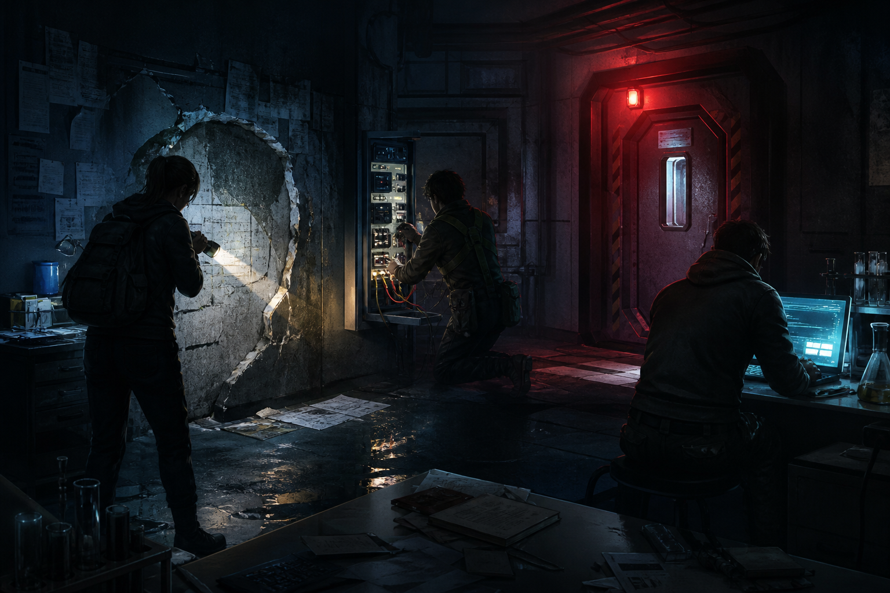
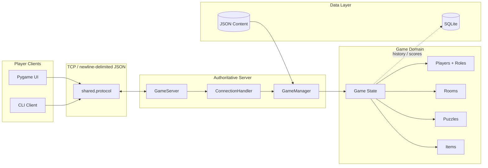
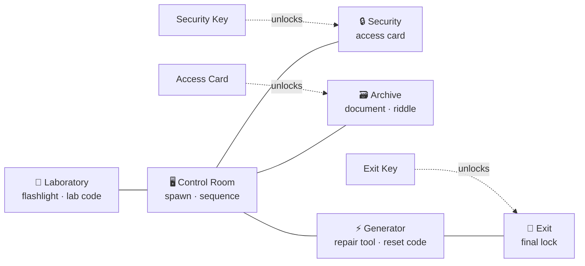

<div align="center">


# BLACKOUT PROTOCOL

### The power is gone. The doors are sealed. The clock is still running.

**A data-driven multiplayer mystery and escape-room foundation built with Python, TCP sockets, Pygame, and SQLite.**

[](https://www.python.org/)
[](https://www.pygame.org/)
[](#wire-protocol)
[](#persistence)
[](#project-status)

[Quick start](#quick-start) · [Gameplay vision](#gameplay-loop) · [Architecture](#architecture) · [Facility map](#facility-map) · [Roadmap](#roadmap)

</div>

---

## Transmission intercepted

Emergency power will survive for **15 minutes**.

Somewhere inside the facility, a chain of locked rooms protects the only exit. Every operative sees a different piece of the situation: the **Investigator** uncovers hidden clues, the **Engineer** restores broken systems, and the **Hacker** works through compromised terminals. No one escapes alone.

Blackout Protocol is designed around short cooperative sessions for **2–4 players**. The current repository provides the core domain models, JSON content pipeline, network message framing, threaded TCP server, CLI client, database schema, and a Pygame UI shell needed to build that experience.

> [!IMPORTANT]
> This repository is an actively evolving game foundation. The architecture and core models are implemented; full server-authoritative gameplay, synchronized multiplayer state, and the finished Pygame experience are tracked in the [roadmap](#roadmap).

## Gameplay loop



1. **Connect** — Join a shared TCP game session with up to three other players.
2. **Choose a role** — Bring a different way of reading and manipulating the facility.
3. **Explore** — Move through a six-room graph of labs, archives, security systems, and machinery.
4. **Investigate** — Collect tools and documents, then combine clues through communication.
5. **Solve** — Submit answers to password, sequence, logic, riddle, and combination puzzles.
6. **Escape** — Reach the final locked door before emergency power reaches zero.

## Operative roles


| Role | Specialty | Signature approach |
| :---: | --- | --- |
| 🔦 **Investigator** | Clues and deduction | Reveals details, connects evidence, and makes sense of incomplete information. |
| ⚡ **Engineer** | Power and machinery | Repairs physical systems and keeps critical infrastructure alive. |
| 💻 **Hacker** | Terminals and access | Decodes network signals and works through restricted digital systems. |

## What is inside

| System | Current implementation |
| --- | --- |
| 🗺️ **World model** | Six connected rooms with locks, required items, puzzles, and pickups loaded from JSON. |
| 🧩 **Puzzle engine** | Five supported puzzle types, normalized answer validation, rewards, and solved state. |
| 🎒 **Inventory** | Typed item models with ownership checks and room-access targets. |
| ⏱️ **Game state** | Player registry, movement validation, countdown calculation, and win/finish flags. |
| 🌐 **Networking** | Newline-delimited JSON messages over TCP and a threaded connection handler. |
| 🖥️ **Clients** | Interactive CLI client plus a 960×540 Pygame window shell running at 60 FPS. |
| 🗄️ **Persistence** | SQLite schema for players, games, scores, roles, results, and duration. |
| 📦 **Content pipeline** | Rooms, puzzles, items, and server settings remain editable without changing Python code. |

## Project status

| Capability | Status |
| --- | :---: |
| Data loading and validation models | ✅ Ready |
| Room graph and movement rules | ✅ Ready |
| Puzzle answer checking | ✅ Ready |
| Inventory and access requirements | ✅ Ready |
| TCP framing and concurrent connections | ✅ Ready |
| CLI network smoke testing | ✅ Ready |
| SQLite schema initialization | ✅ Ready |
| Full session lifecycle and lobby | 🚧 In progress |
| Server-authoritative actions and rewards | 🧭 Planned |
| Real-time shared state synchronization | 🧭 Planned |
| Complete Pygame screens and interactions | 🧭 Planned |
| Integrated score/history persistence | 🧭 Planned |

## Architecture



The transport layer is deliberately separate from the game domain. That keeps puzzle rules testable, allows the CLI and Pygame clients to share one protocol, and lets the server become authoritative without coupling gameplay to rendering.

## Facility map



The facility content is completely data-driven. At present it contains **6 rooms**, **4 puzzles**, and **6 items**. Add or rebalance content in `data/` without touching the network or rendering layers.

## Quick start

### 1. Clone and enter the project

```bash
git clone https://github.com/Fatima-Setayesh/blackout-protocol.git
cd blackout-protocol
```

### 2. Create an isolated environment

<details open>
<summary><strong>Windows · PowerShell</strong></summary>

```powershell
py -m venv .venv
.venv\Scripts\Activate.ps1
python -m pip install --upgrade pip
pip install -r requirements.txt
```

</details>

<details>
<summary><strong>macOS / Linux</strong></summary>

```bash
python3 -m venv .venv
source .venv/bin/activate
python -m pip install --upgrade pip
pip install -r requirements.txt
```

</details>

### 3. Verify the content pipeline

```bash
python main.py
```

Expected result:

```text
Blackout Protocol project scaffold is ready.
Loaded 6 rooms, 4 puzzles, and 6 items.
```

## Run the network prototype

Open two terminals from the repository root.

**Terminal 1 — server**

```bash
python -m server.server
```

**Terminal 2 — client**

```bash
python -m client.client
```

Enter a username, send messages, and type `quit` or `exit` to disconnect. Additional client terminals can connect to exercise the threaded server.

### Launch the Pygame shell

```bash
python -m client.ui
```

## Wire protocol

Messages are UTF-8 JSON objects separated by newlines. The shared encoder and decoder keep both ends consistent.

```json
{
  "type": "MOVE",
  "data": {
    "target_room": "archive"
  }
}
```

Defined event types:

```text
JOIN_GAME · MOVE · PICK_ITEM · PUZZLE_ANSWER · CHAT
STATE_UPDATE · GAME_OVER · ERROR
```

## Persistence

Initialize the local SQLite database with:

```bash
python -m database.database
```

This creates `blackout.db` with `players`, `games`, and `scores` tables. Local database files are ignored by Git.

## Configuration and content

| File | Purpose |
| --- | --- |
| `data/config.json` | Host, port, 900-second timer, player limits, and spawn room. |
| `data/rooms.json` | Facility graph, locks, connections, puzzles, and item placement. |
| `data/puzzles.json` | Questions, accepted answers, puzzle types, and rewards. |
| `data/items.json` | Inventory objects, descriptions, types, and access targets. |

## Repository layout

```text
blackout-protocol/
├── client/                 # CLI client, Pygame shell, client assets
├── data/                   # Editable game content and configuration
├── database/               # SQLite schema and connection manager
├── docs/assets/            # README artwork
├── game/                   # Domain models and gameplay rules
├── server/                 # TCP server, handlers, data manager
├── shared/                 # JSON wire protocol shared by both ends
├── main.py                 # Fast project/data smoke check
└── requirements.txt        # Runtime dependencies
```

## Roadmap

- [x] Model rooms, puzzles, items, players, roles, and timed game state
- [x] Load world content from JSON
- [x] Frame and validate TCP messages
- [x] Accept concurrent client connections
- [x] Create the SQLite schema
- [x] Establish the Pygame render loop
- [ ] Add game creation, lobby codes, and role selection
- [ ] Route protocol events through a server-owned `Game` instance
- [ ] Implement puzzle rewards and atomic item pickup
- [ ] Broadcast room, player, timer, and inventory state
- [ ] Build lobby, map, puzzle, inventory, chat, and end-state screens
- [ ] Persist completed games and player scores
- [ ] Add automated domain, protocol, and integration tests
- [ ] Package the client and add a recorded gameplay demo

## Design principles

- **Server authority** — clients express intent; the server owns truth.
- **Data before code** — content belongs in JSON, mechanics belong in Python.
- **Small messages** — protocol events stay explicit, inspectable, and easy to debug.
- **Separation of concerns** — networking, rules, storage, and presentation evolve independently.
- **Cooperation by design** — roles should exchange information, not merely share a room.

## Contributing

1. Create a focused branch: `git switch -c feat/puzzle-rewards`
2. Keep game rules independent from Pygame rendering.
3. Add or update tests when changing protocol or domain behavior.
4. Run `python main.py` and exercise the server/client flow.
5. Open a pull request explaining player-facing behavior and protocol changes.

Suggested commit style:

```text
feat: synchronize player movement
feat: award puzzle items on the server
fix: preserve partial TCP messages
test: cover locked-room access rules
docs: record multiplayer setup
```

## Visuals

The images in this README are original concept artwork created for Blackout Protocol. They communicate the intended atmosphere and role fantasy; they are not presented as screenshots of the current Pygame shell.

## License

No license has been published yet. Until one is added, the repository remains **all rights reserved** by its copyright holder.

---

<div align="center">

### `POWER: 00:14:59` · `PLAYERS: 3/4` · `EXIT: LOCKED`

**Restore the grid. Decode the facility. Get everyone out.**

</div>
